# Enterprise IT Help Desk & Ticket Management System

A full-stack, enterprise-style IT support and help desk application built as a portfolio project. Employees can raise and track incidents, IT technicians can manage and resolve tickets through structured workflows, managers can monitor analytics and SLA performance, and administrators can manage users, categories, and SLA policies — all backed by a real PostgreSQL database and REST API.

> **Note:** This is a development/portfolio application. It is not production-hardened.

---

## Features

### Employee

- Employee login and JWT authentication
- Create IT support tickets with title, description, category, subcategory, and priority
- Browse ticket categories and subcategories (Hardware, Software, Network, Access)
- View own tickets with search and filtering
- View ticket status, SLA indicators, and resolution details
- View ticket activity/history timeline
- Add public comments and reply to technicians
- Close resolved tickets and submit satisfaction feedback


### IT Technician

- Technician dashboard with assigned, unassigned, priority, and SLA summary cards
- Unassigned ticket queue and assigned ticket views
- Accept tickets from the open queue
- Start working on tickets (status transitions)
- Add public comments and internal troubleshooting notes
- Update troubleshooting notes, root cause, and resolution details
- Resolve tickets with required resolution notes
- Escalate tickets between support levels (L1 → L2 → L3)
- View ticket activity timeline and SLA status


### Manager

- Manager dashboard with live ticket statistics from PostgreSQL
- SLA compliance monitoring (compliance percentage, breached ticket count)
- Charts: tickets by status, priority, category, department, and technician
- Technician performance overview
- Reports & analytics page (volume, resolution time, SLA compliance, department breakdown)


### Administrator

- User management (create, edit, activate/deactivate, assign role and department)
- Category and subcategory overview
- SLA policy configuration (response and resolution times per priority)
- Full system dashboard (same analytics as manager)
- Knowledge base article management via API (create, update, delete); all roles can browse articles in the UI


### SLA Management

Configurable SLA policies are stored in the database and applied automatically when tickets are created. A background cron job runs every 5 minutes to detect at-risk and breached tickets and generate notifications.


| Priority | Response Time | Resolution Time |
| -------- | ------------- | --------------- |
| Critical | 15 minutes    | 2 hours         |
| High     | 30 minutes    | 4 hours         |
| Medium   | 2 hours       | 8 hours         |
| Low      | 4 hours       | 24 hours        |


**SLA states (computed at runtime):**


| State    | Description                                                     |
| -------- | --------------------------------------------------------------- |
| On Track | More than 25% of resolution time remaining                      |
| At Risk  | 25% or less time remaining before breach                        |
| Breached | Resolution deadline passed and ticket is not resolved or closed |


### Knowledge Base

Searchable IT support knowledge base with seeded articles covering common scenarios:

- Outlook not syncing
- VPN connection failure
- Windows password reset
- Printer not responding
- Wi-Fi connectivity issue
- Account locked
- Shared folder access denied

---


## Ticket Lifecycle

Primary workflow:

```
OPEN → ASSIGNED → IN_PROGRESS → RESOLVED → CLOSED
```

**Additional states and paths:**

- `IN_PROGRESS` ↔ `PENDING_USER` — awaiting employee response
- `IN_PROGRESS` → `ESCALATED` → `IN_PROGRESS` — escalated to L2/L3 support
- Invalid status transitions are rejected with HTTP `409 Conflict`
- Ticket numbers are generated atomically (e.g. `INC-2026-00001`) via a `TicketCounter` table

**Escalation levels:**

```
L1 IT Support
    ↓
L2 Infrastructure / Application
    ↓
L3 Engineering / Network
```

Each escalation records the reason, notes, levels, and creates history entries and notifications.

---


## System Architecture

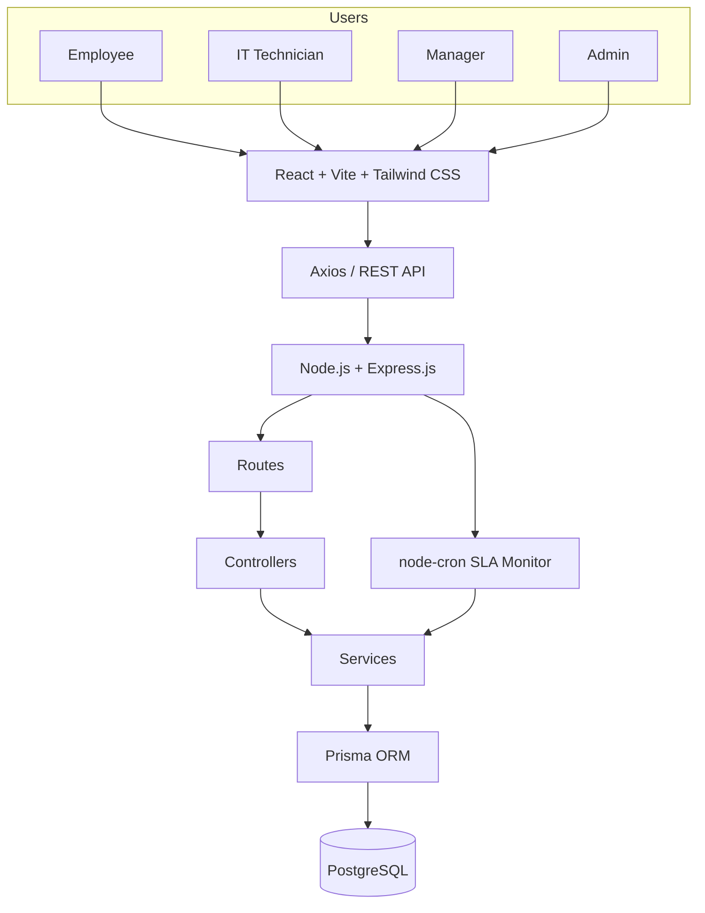


Business logic lives in **service layers** (not in routes or controllers). **PostgreSQL** is the single persistent data store — no mock or static frontend data for tickets, users, or analytics.

---


## Tech Stack


| Layer                     | Technologies                                                                              |
| ------------------------- | ----------------------------------------------------------------------------------------- |
| **Frontend**              | React.js, Vite, Tailwind CSS, React Router, Axios, Recharts, date-fns, lucide-react, clsx |
| **Backend**               | Node.js, Express.js, Prisma ORM, REST API, JWT authentication, bcryptjs                   |
| **Database**              | PostgreSQL                                                                                |
| **Validation / Security** | Zod, Helmet, CORS, express-rate-limit, Role-Based Access Control (RBAC)                   |
| **Background Jobs**       | node-cron (SLA monitoring)                                                                |
| **Development**           | Git, GitHub, REST APIs compatible with Postman                                            |


---


## Project Structure

```
client/
  src/
    components/     # Reusable UI (badges, tables, charts, ticket widgets, layout)
    context/        # Auth and toast notification state
    hooks/          # useNotifications, useDebounce
    layouts/        # Auth layout wrapper
    pages/          # Role-based pages (employee, technician, manager, admin, knowledge)
    services/       # Axios API clients
    utils/          # Constants, formatters, SLA helpers, permissions

server/
  prisma/
    schema.prisma   # Database models and relationships
    seed.js         # Demo data (users, tickets, KB articles, SLA policies)
    migrations/     # Prisma migration history
  src/
    config/         # Environment validation, Prisma client
    controllers/    # Thin HTTP handlers
    middleware/     # Auth, RBAC, validation, error handling
    routes/         # REST API route definitions
    services/       # Business logic (tickets, SLA, notifications, dashboard)
    validators/     # Zod request schemas
    utils/          # JWT, password hashing, state machine, errors
    jobs/           # SLA monitor cron job
```


| Folder                  | Purpose                                                  |
| ----------------------- | -------------------------------------------------------- |
| `client/src/pages`      | Role-specific dashboards, ticket views, admin panels     |
| `client/src/services`   | Centralized API calls with JWT interceptors              |
| `server/src/services`   | Core business rules (ticket lifecycle, SLA, RBAC checks) |
| `server/src/middleware` | Authentication, authorization, and input validation      |
| `server/prisma`         | Database schema, migrations, and seed script             |


---


## How to Run Locally


### Prerequisites

- Node.js 18+
- PostgreSQL 14+
- npm

> **macOS note:** Port `5000` is often used by AirPlay Receiver. This project defaults to API port **5001**.


### 1. Clone the repository

```bash
git clone <your-repo-url>
cd <project-folder>
```


### 2. Install dependencies

```bash
# Backend
cd server
npm install

# Frontend
cd ../client
npm install
```


### 3. Configure environment variables

```bash
cp server/.env.example server/.env
cp client/.env.example client/.env
```

Edit `server/.env`:

```env
NODE_ENV=development
PORT=5001
DATABASE_URL=postgresql://USERNAME@localhost:5433/helpdesk_db
JWT_SECRET=your-super-secret-jwt-key-minimum-32-characters-long
JWT_EXPIRES_IN=8h
CLIENT_URL=http://localhost:5173
SLA_CHECK_INTERVAL_CRON=*/5 * * * *
```

Edit `client/.env`:

```env
VITE_API_URL=http://localhost:5001/api
```

Replace `USERNAME` and the PostgreSQL port (`5433`) with values matching your local installation. Common ports are `5432` or `5433`.

### 4. Start PostgreSQL

Ensure PostgreSQL is running locally. Example (Homebrew):

```bash
brew services start postgresql@15
# or start manually on a custom port if needed
```


### 5. Create the database

```bash
createdb helpdesk_db
# If using a non-default port:
# createdb -p 5433 helpdesk_db
```


### 6. Run Prisma migrations

```bash
cd server
npx prisma generate
npx prisma migrate dev
```


### 7. Seed demo data

```bash
npm run db:seed
```


### 8. Start the backend

```bash
cd server
npm run dev
```

API available at: **[http://localhost:5001/api](http://localhost:5001/api)**

Verify:

```bash
curl http://localhost:5001/api/health
```


### 9. Start the frontend

Open a second terminal:

```bash
cd client
npm run dev
```

App available at: **[http://localhost:5173](http://localhost:5173)**

---


## Demo Credentials


| Role          | Email                                               | Password |
| ------------- | --------------------------------------------------- | -------- |
| Employee      | [employee@company.com](mailto:employee@company.com) | Demo@123 |
| IT Technician | [tech.l1@company.com](mailto:tech.l1@company.com)   | Demo@123 |
| IT Manager    | [manager@company.com](mailto:manager@company.com)   | Demo@123 |
| Administrator | [admin@company.com](mailto:admin@company.com)       | Demo@123 |


> These are **development/demo credentials only**. Do not use in production. Change all passwords and secrets before any real deployment.

Additional seeded account: `tech.l2@company.com` (L2 Technician, same password).

---


## Screenshots

### Employee Dashboard

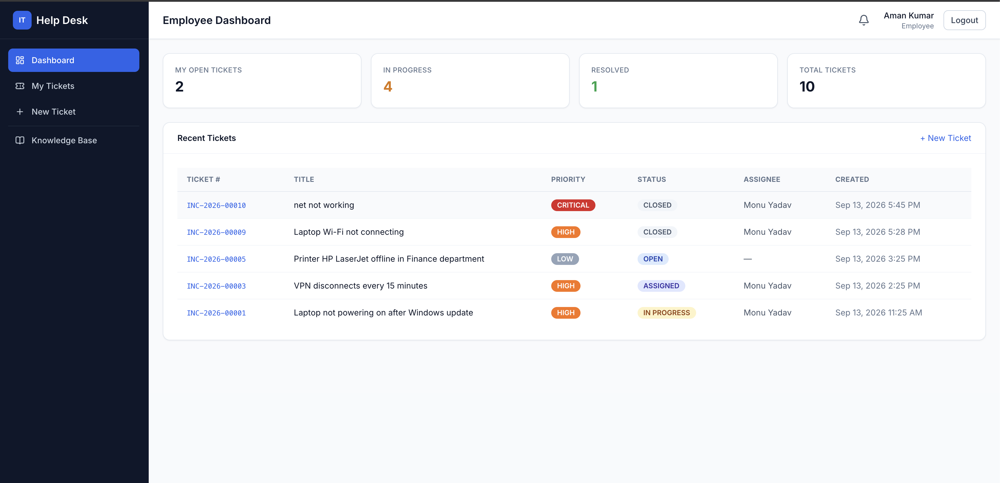

*Employee portal showing open, in-progress, and recent tickets.*

### Create Ticket

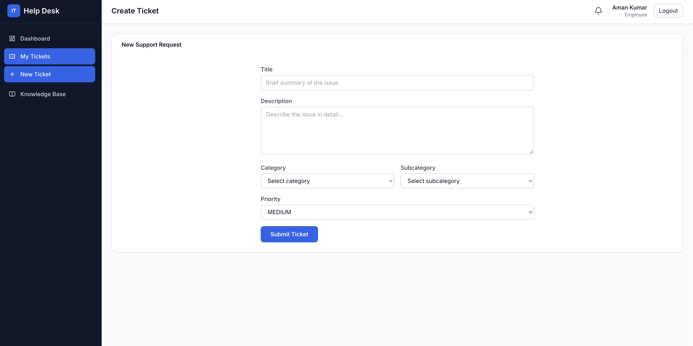

*Ticket submission form with category, subcategory, and priority selection.*

### Technician Dashboard

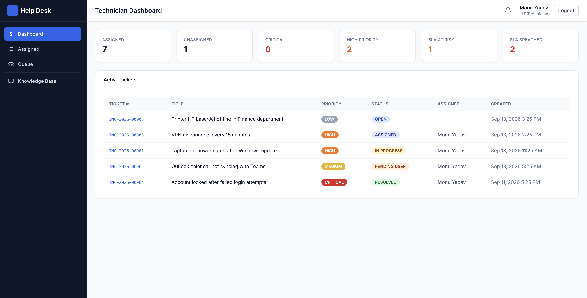

*Technician view with assigned queue, SLA at-risk, and priority summaries.*

### Ticket Resolution

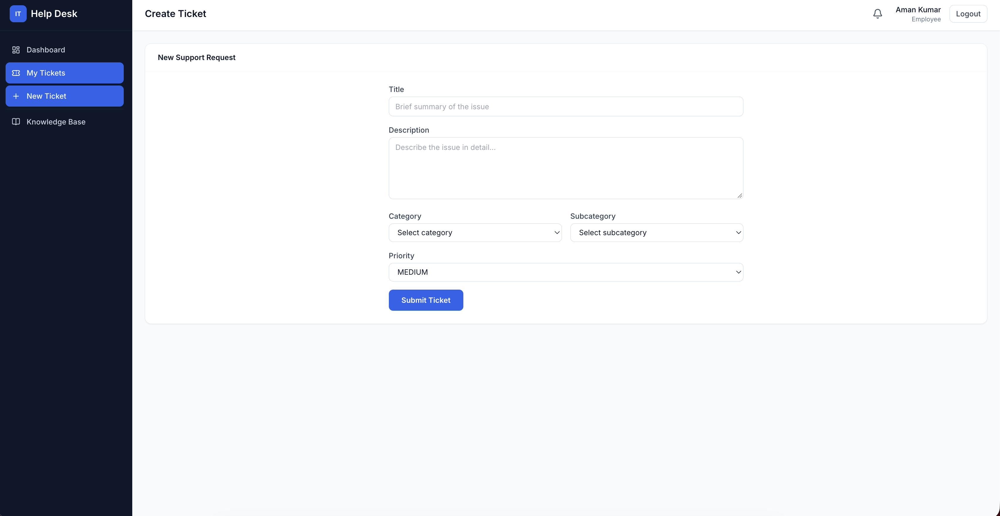

*Ticket detail with troubleshooting notes, resolution, and activity timeline.*

### Manager Dashboard

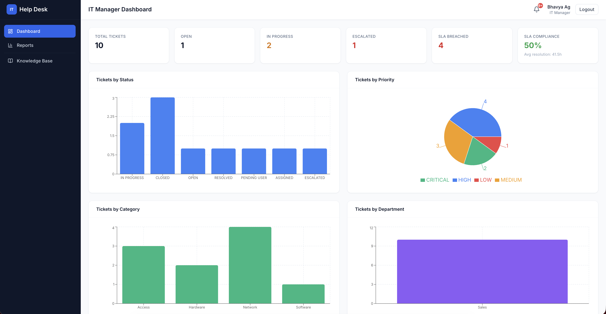

*Manager analytics with KPI cards and live charts from PostgreSQL.*

### Reports

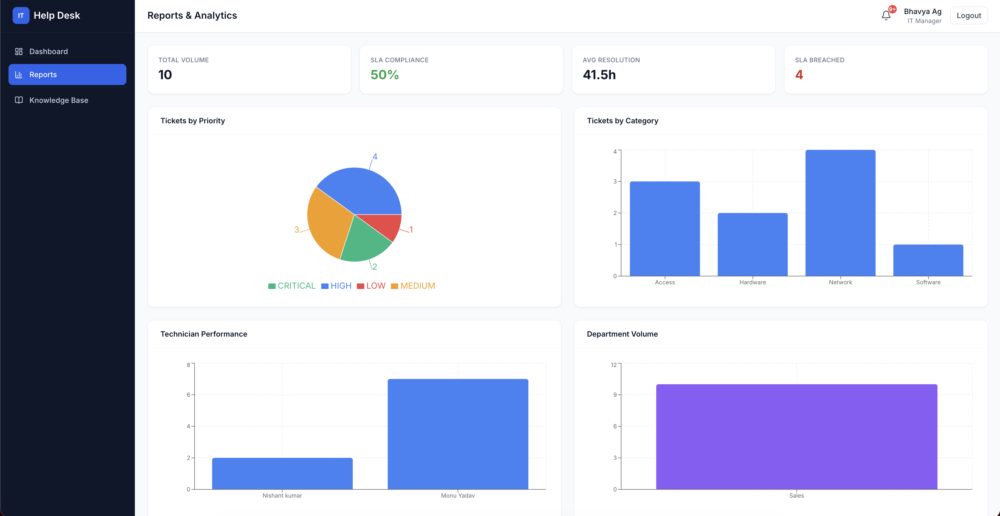

*Reports page with SLA compliance, resolution time, and department volume.*

### Admin — User Management

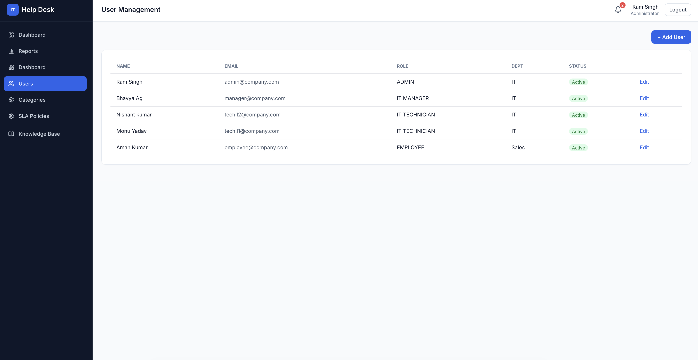

*Administrator panel for creating and managing user accounts.*

### Admin — Categories

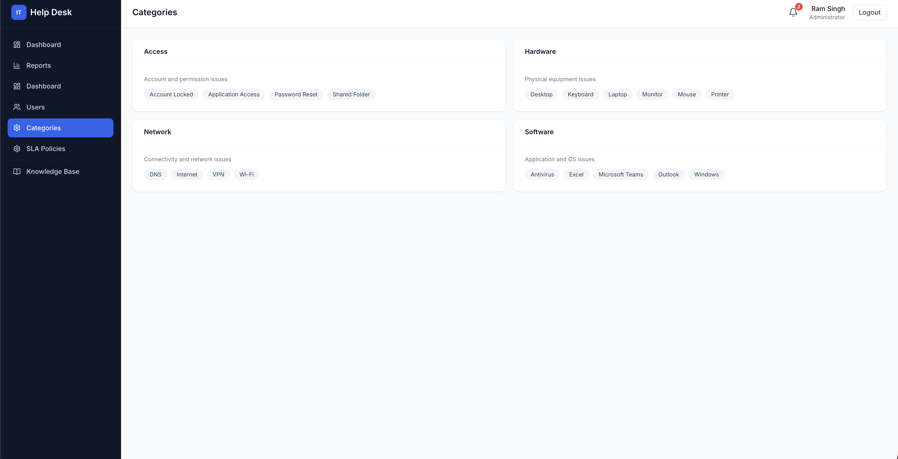

*Category and subcategory overview for IT support classification.*

### Admin — SLA Policies

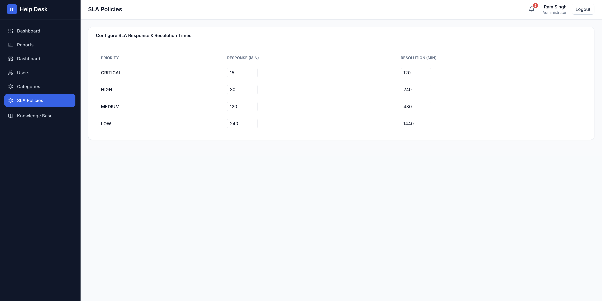

*Configurable SLA response and resolution times per priority level.*

### Knowledge Base

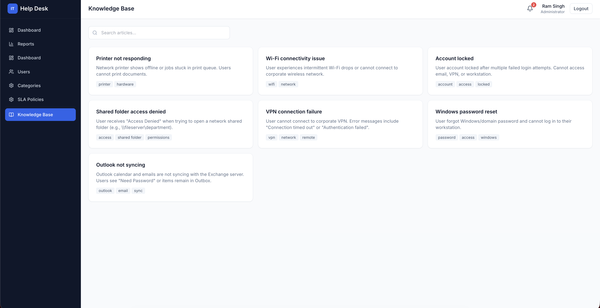

*Searchable IT support articles with tags and troubleshooting steps.*

---


## Security


| Mechanism        | Implementation                                                                      |
| ---------------- | ----------------------------------------------------------------------------------- |
| Authentication   | JWT tokens (`userId`, `role`, `email`) via `Authorization: Bearer` header           |
| Password storage | bcryptjs hashing (12 salt rounds); passwords never returned in API responses        |
| Authorization    | Role-based access control enforced on backend routes and services                   |
| Input validation | Zod schemas on request body, query, and params                                      |
| HTTP hardening   | Helmet security headers                                                             |
| CORS             | Restricted to `CLIENT_URL` from environment                                         |
| Rate limiting    | Applied to login endpoint (20 requests per 15 minutes)                              |
| Secrets          | `JWT_SECRET`, `DATABASE_URL`, and other values loaded from `.env` — never hardcoded |
| Audit            | Ticket history records all significant state changes                                |


---


## API Overview

Base URL: `http://localhost:5001/api`


| Area               | Method | Endpoint                       | Access                                                |
| ------------------ | ------ | ------------------------------ | ----------------------------------------------------- |
| **Health**         | GET    | `/health`                      | Public                                                |
| **Auth**           | POST   | `/auth/login`                  | Public                                                |
| **Auth**           | GET    | `/auth/me`                     | Authenticated                                         |
| **Auth**           | POST   | `/auth/logout`                 | Authenticated                                         |
| **Tickets**        | POST   | `/tickets`                     | Authenticated                                         |
| **Tickets**        | GET    | `/tickets`                     | Authenticated (role-scoped)                           |
| **Tickets**        | GET    | `/tickets/:id`                 | Authenticated (role-scoped)                           |
| **Tickets**        | PATCH  | `/tickets/:id`                 | IT roles                                              |
| **Tickets**        | POST   | `/tickets/:id/accept`          | IT roles                                              |
| **Tickets**        | POST   | `/tickets/:id/assign`          | Manager+ / IT                                         |
| **Tickets**        | POST   | `/tickets/:id/status`          | IT roles                                              |
| **Comments**       | POST   | `/tickets/:id/comments`        | Authenticated (role-scoped)                           |
| **Comments**       | GET    | `/tickets/:id/comments`        | Authenticated (internal notes filtered for employees) |
| **Tickets**        | POST   | `/tickets/:id/escalate`        | IT roles                                              |
| **Tickets**        | POST   | `/tickets/:id/resolve`         | IT roles                                              |
| **Tickets**        | POST   | `/tickets/:id/close`           | Requester / IT                                        |
| **Tickets**        | POST   | `/tickets/:id/feedback`        | Employee (requester)                                  |
| **Tickets**        | GET    | `/tickets/:id/history`         | Authenticated (role-scoped)                           |
| **Dashboard**      | GET    | `/dashboard/stats`             | Manager, Admin                                        |
| **Dashboard**      | GET    | `/dashboard/charts/status`     | Manager, Admin                                        |
| **Dashboard**      | GET    | `/dashboard/charts/priority`   | Manager, Admin                                        |
| **Dashboard**      | GET    | `/dashboard/charts/category`   | Manager, Admin                                        |
| **Dashboard**      | GET    | `/dashboard/charts/department` | Manager, Admin                                        |
| **Dashboard**      | GET    | `/dashboard/charts/technician` | Manager, Admin                                        |
| **Dashboard**      | GET    | `/dashboard/reports`           | Manager, Admin                                        |
| **Users**          | GET    | `/users`                       | Admin                                                 |
| **Users**          | POST   | `/users`                       | Admin                                                 |
| **Users**          | GET    | `/users/:id`                   | Admin                                                 |
| **Users**          | PATCH  | `/users/:id`                   | Admin                                                 |
| **Users**          | GET    | `/users/technicians`           | IT roles                                              |
| **Categories**     | GET    | `/categories`                  | Authenticated                                         |
| **Categories**     | PATCH  | `/categories/:id`              | Admin                                                 |
| **Departments**    | GET    | `/departments`                 | Authenticated                                         |
| **SLA**            | GET    | `/sla-policies`                | Admin                                                 |
| **SLA**            | PATCH  | `/sla-policies/:id`            | Admin                                                 |
| **Knowledge Base** | GET    | `/knowledge-base`              | Authenticated                                         |
| **Knowledge Base** | GET    | `/knowledge-base/:id`          | Authenticated                                         |
| **Knowledge Base** | POST   | `/knowledge-base`              | IT Technician, Manager, Admin                         |
| **Knowledge Base** | PATCH  | `/knowledge-base/:id`          | IT Technician, Manager, Admin                         |
| **Knowledge Base** | DELETE | `/knowledge-base/:id`          | Admin                                                 |
| **Notifications**  | GET    | `/notifications`               | Authenticated                                         |
| **Notifications**  | PATCH  | `/notifications/:id/read`      | Authenticated                                         |
| **Notifications**  | PATCH  | `/notifications/read-all`      | Authenticated                                         |


---


## Database

PostgreSQL relational schema managed with Prisma ORM.


| Model              | Description                                                         |
| ------------------ | ------------------------------------------------------------------- |
| `User`             | Accounts with role, department, escalation level, active status     |
| `Department`       | Organizational departments (IT, HR, Finance, etc.)                  |
| `Category`         | Ticket categories (Hardware, Software, Network, Access)             |
| `Subcategory`      | Subcategories linked to categories                                  |
| `SLAPolicy`        | Response and resolution times per priority                          |
| `Ticket`           | Core incident record with SLA dates, status, assignment, resolution |
| `TicketComment`    | Public comments and internal notes                                  |
| `TicketHistory`    | Audit trail with action type and JSON metadata                      |
| `Escalation`       | Escalation records (from/to level, reason, notes)                   |
| `KnowledgeArticle` | KB articles with tags, troubleshooting steps, resolution            |
| `Notification`     | In-app notifications per user                                       |
| `TicketCounter`    | Atomic ticket number sequence per year                              |


---


## Testing the Workflow

End-to-end demo flow:

1. **Login as Employee** (`employee@company.com`)
2. **Create a ticket** — navigate to New Ticket, fill category, priority, and description
3. **Login as Technician** (`tech.l1@company.com`)
4. **Accept the ticket** from the unassigned queue (or assign via Manager)
5. **Start working** — change status to `IN_PROGRESS`
6. **Add a troubleshooting comment** (optionally mark as internal note)
7. **Resolve the ticket** — provide resolution notes, root cause, and troubleshooting summary
8. **Login as Employee** again
9. **Close the resolved ticket** and optionally submit feedback
10. **Login as Manager** (`manager@company.com`) — view dashboard stats, charts, and Reports page to confirm the ticket appears in analytics

---


## Future Improvements

The following are **planned enhancements**, not currently implemented:

- Email notifications for ticket events
- File attachments on tickets
- Advanced audit and compliance reporting
- Production deployment (Docker, CI/CD, cloud hosting)
- Automated test suite (unit, integration, E2E)
- Docker Compose for one-command local setup
- Business-hours SLA clock (pause on `PENDING_USER`)
- Refresh token rotation and session management
- Real-time notifications via WebSocket

---


## Author

**Nishant Kumar**

Full-stack IT Support / Help Desk portfolio project demonstrating incident management, SLA tracking, RBAC, troubleshooting workflows, reporting, and enterprise-style support operations.

---


## License

MIT